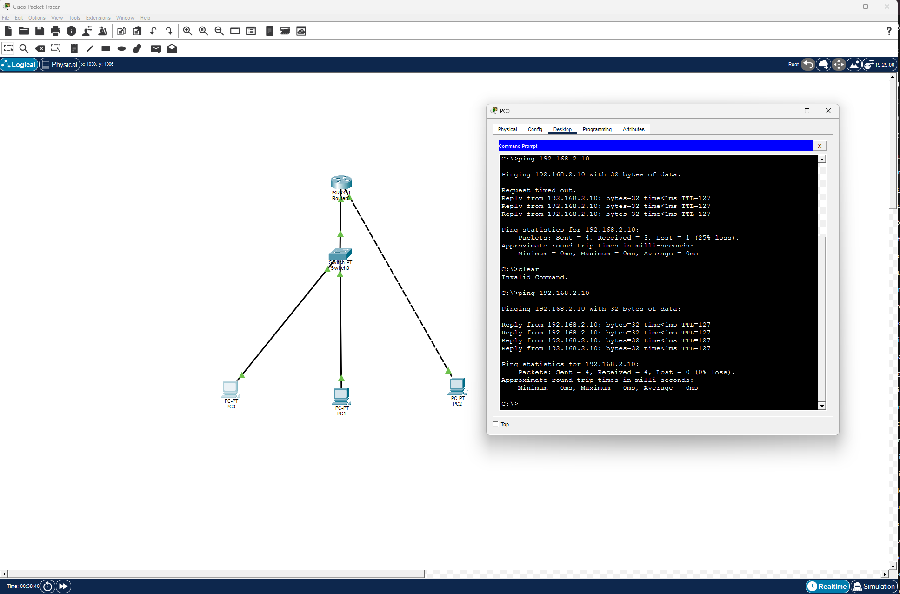

## 🧪 Lab — Roteamento entre Duas Redes (Packet Tracer)
### 🎯 Objetivo

Permitir comunicação entre PCs em redes diferentes usando um roteador.

## 🖥️ Topologia

- 1 Roteador (ISR)

- 1 Switch

- 3 PCs

## 🌐 Endereçamento IP

### Rede 1 — 192.168.1.0/24

- PC1: 192.168.1.10 /24
- PC2: 192.168.1.20 /24
- Gateway: 192.168.1.1

### Rede 2 — 192.168.2.0/24

- PC3: 192.168.2.10 /24
- Gateway: 192.168.2.1

## ⚙️ Configuração do Roteador
```
enable
configure terminal

interface g0/0/0
 ip address 192.168.1.1 255.255.255.0
 no shutdown
 exit

interface g0/0/1
 ip address 192.168.2.1 255.255.255.0
 no shutdown
 exit

```
- ## ✅ Testes

- Ping entre PCs da mesma rede → OK  
- Ping entre PCs de redes diferentes (192.168.1.0/24 ↔ 192.168.2.0/24) → OK  



## 📌 Conceitos praticados

- Configuração de múltiplas interfaces no roteador
- Separação de redes (sub-redes)
- Uso de Default Gateway
- Teste de conectividade com ping
