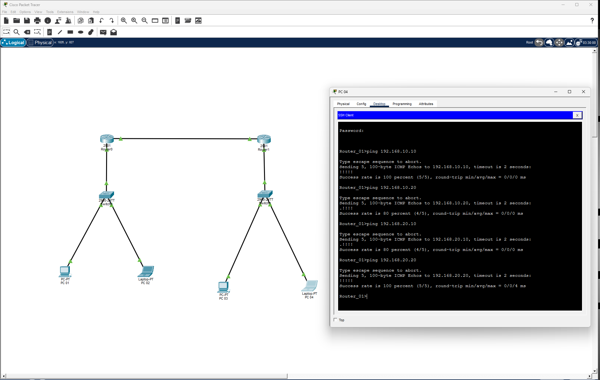

### Lab Packet Tracer — Roteamento entre Redes + VLAN + SSH
# 🎯 Objetivo

# Simular duas redes separadas interligadas por roteadores, com VLAN, roteamento entre redes e acesso remoto SSH.

## 🖥️ Topologia e Testes de Conectividade
🔹 Rede 1 – 192.168.10.0/24

```
Router 01 (G0/1): 192.168.10.1

Switch 01 (VLAN1): 192.168.10.2

PC 01: 192.168.10.10 /24

PC 02: 192.168.10.20 /24
```

🔹 Rede 2 – 192.168.20.0/24

```
Router 02 (G0/0): 192.168.20.1

Switch 02 (VLAN1): 192.168.20.2

PC 03: 192.168.20.10 /24

PC 04: 192.168.20.20 /24
```

🔹 Link entre roteadores (/30)

```
Router 01: 10.0.0.1 /30

Router 02: 10.0.0.2 /30
```

## ⚙️ Configurações realizadas

```
VLAN e gateway nos switches

Interfaces roteadores configuradas e ativadas

Rotas estáticas entre redes

Testes de conectividade (ping)

SSH configurado para acesso remoto seguro
```

## ✅ Resultado

Comunicação validada entre redes distintas, roteamento funcional e acesso remoto SSH operacional.

## 🖼️ Topologia



## 📂 Arquivo .pkt disponível para reprodução completa do cenário.

[Baixar arquivo Packet Tracer](../configuracoes/packet-tracer/lab-packettracer-roteamento.pkt)
